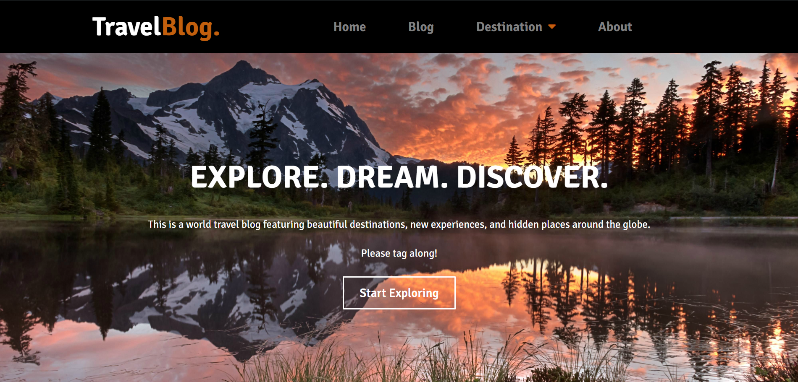

# 🌍 Travel Blog Website  

A **multi-page, responsive travel blog** created as a course project to showcase travel stories and destinations. Built with a **mobile-first approach**, the website offers an intuitive user experience, modular architecture, and interactive maps.  

---

## 📸 Preview  
> *(Add screenshots of your project here)*  
  
  

---

## ✨ Features  

- 📱 **Responsive Design** – Optimized for desktop, tablet, and mobile devices  
- 🧩 **Modular Architecture** – Reusable navigation bar & footer across 9 pages  
- 🗺️ **Interactive Maps** – Integrated **Google Maps API** for exploring destinations  
- 💬 **Client-Side Comments** – Users can leave feedback with browser local storage  
- 🎨 **Clean UI/UX** – Minimal, user-friendly interface for smooth navigation  

---

## 🛠️ Tech Stack  

- **Frontend:** HTML, CSS, JavaScript  
- **APIs:** Google Maps API  
- **Storage:** Browser Local Storage  
- **Design Approach:** Mobile-first, modular structure  

---

## 🚀 Getting Started  

Follow these steps to set up the project locally:  

```bash
# Clone the repository
git clone https://github.com/AbhiKumar797/Travel-Blog.git

# Navigate into the project directory
cd Travel-Blog

# Open index.html in your browser
👉 No external server setup required. The project is entirely client-side.

📂 Project Structure
bash
Copy code
Travel-Blog/
│── index.html
│── about.html
│── destinations.html
│── blog.html
│── contact.html
│── /css
│   └── style.css
│── /js
│   └── main.js
│── /images
└── README.md
📌 Future Improvements
Add backend support for user authentication & blog storage

Enhance comments system with database integration

Include a photo gallery and search functionality

🤝 Contributing
Contributions, issues, and feature requests are welcome!
Feel free to fork this repo and submit a pull request.
